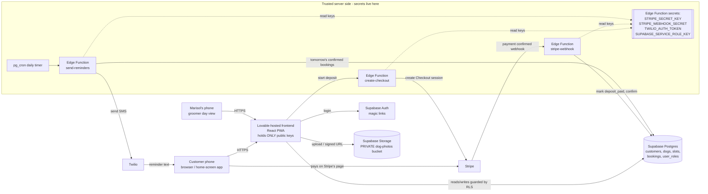

Your input is all here: a filled-in SPEC Context Carry and your constraints. It is the right input for stage 3, so here's the architecture.

---

# Before we start: App Store app or home-screen web app?

**Short answer: build a web app that people add to their home screen. Don't build an App Store app for V1.**

Here's why, in plain English:

- **Lovable only makes web apps.** As far as I know, Lovable builds websites that run in a browser. It can't produce an app you submit to Apple's App Store or Google Play. (Check Lovable's current docs, because this could change.) Your build tool settles most of the question.
- **A web app can be put on the home screen.** A "Progressive Web App" (PWA) is a website that can be saved to a phone's home screen. It gets its own icon, opens full-screen without the browser bar, and feels like an app. It works on iPhone and Android from one build. On iPhone the customer opens the site in Safari, taps Share, then "Add to Home Screen". On Android, Chrome usually offers "Install app" on its own.
- **Your customers won't use it much.** They book every few weeks and pay a deposit. Most visits will come from a link in the reminder text. A link in a text opens a website straight away, while an App Store app has to be downloaded first. For this business, "tap the link in your text" beats "go find us in the App Store".
- **The App Store route doesn't fit your constraints.** It costs about $99/year for Apple and $25 once for Google (check the current fees). Every update waits for review. Getting a Lovable site into the stores would need either (a) a "wrapper" tool like Capacitor, which requires Xcode and the terminal, or (b) a paid wrapping service. Apple also often rejects apps that are just a website in a wrapper, under its "minimum functionality" rule.

**What to tell customers who asked for "a real app":** "Save GroomGo to your home screen. It's one tap, it has its own icon, and you'll never need to update it."

**If the App Store becomes a must later,** your options are: (1) a paid wrapping service, accepting the risk that Apple rejects it; (2) hire a developer for a few hours to wrap it with Capacitor; or (3) rebuild the front end in a tool that makes mobile apps, such as FlutterFlow or an Expo-based builder. Your database, payments and texting would stay the same. Nothing below blocks any of these.

Because this is a **web-only app**, I've skipped the MOBILE notes in sections 1, 4, 5 and 10.

---

# ARCHITECTURE.md: GroomGo

## 1. Stack Decision

A few terms first:
- **Frontend**: what people see and tap.
- **Backend**: code that runs on a server you control, out of users' reach.
- **Database**: where all the records live.
- **Auth** (short for authentication): logging in.

| Layer | Choice | Why | Rejected alternative & why |
|---|---|---|---|
| Frontend | **React + Tailwind, generated by Lovable, set up as a PWA** (installable web app) | **Lovable decides this layer.** It always produces React. Adding a "web app manifest" (a small file with the app's name and icon) makes it installable on phones. | Native iPhone/Android apps. Lovable can't build them, and they'd need a terminal plus store fees and reviews (see above). |
| Backend / API | **Supabase Edge Functions** (small pieces of server code that run on Supabase's computers when called) | Lovable connects to Supabase, either through "Lovable Cloud" or your own Supabase project, and writes these functions for you. Secret keys and payment logic live here. | A separate server (Node/Express on Render, for example). It's one more thing to host, pay for and look after. |
| Database | **Supabase Postgres** (a standard, very widely used database) | Built into Lovable. It includes "Row Level Security" (RLS): rules inside the database that decide which rows each logged-in person may see or change. RLS is how we guarantee customers never see each other's addresses. | Firebase. Lovable doesn't use it by default, and its rule system is easier to get wrong for this kind of data. |
| Auth | **Supabase Auth with email magic links** (the customer types their email and gets a one-tap login link) | Free, no passwords to forget, and built into Lovable. | Phone-number login codes by SMS. Every login costs a text, and it needs the same business texting registration as reminders. Easy to add later. |
| File storage | **Supabase Storage, private bucket** (a "bucket" is a folder for uploaded files) for dog photos | Same account, same permission system. Photos are served through expiring links. | A public bucket, which is Lovable's frequent default. Anyone with the link could see any dog photo forever. |
| Payments | **Stripe Checkout** (a payment page hosted by Stripe), plus a **Stripe webhook** | You already have Stripe. Stripe's own page handles card entry, Apple Pay and Google Pay, so card numbers never touch your app. A "webhook" is Stripe calling your server to say "this payment really went through". It's the only trusted proof of payment. | A card form built inside your app. That's more security responsibility for no benefit. |
| AI / LLM | **None** | Nothing in the spec needs AI. | n/a |
| Hosting | **Lovable hosting**, with your own domain (like `groomgo.com`) | **Lovable decides this layer.** One click publishes. | Vercel or Netlify. They'd need exporting code and more setup, for no gain. |
| Email / notifications | **Twilio SMS** for reminder texts. Supabase's built-in email for login links. | Twilio is the standard, well-documented texting service. A daily scheduled job (Supabase **pg_cron**, a built-in timer that runs a task every day at a set time) sends tomorrow's reminders. | Push notifications. On iPhone they only work after the customer installs the home-screen app and grants permission, and texts reach everyone. |

## 2. System Diagram

This is a "Mermaid" diagram, a text format that many tools, GitHub included, draw as a picture.

## 3. Data Model

A few terms:
- **uuid**: a long random ID.
- **FK** (foreign key): a link to a row in another table.
- **Index**: a lookup shortcut that makes searches fast.
- **Enum**: a field that only allows a fixed list of values.

I've added three things the spec implies but didn't list: a login link on each customer, a `slots` table so Marisol controls her availability, and a `user_roles` table.

**user_roles** (who is the groomer)
| Field | Type | Notes |
|---|---|---|
| user_id | uuid, PK, FK → auth.users | one row per user |
| role | enum `customer` / `groomer` | Marisol's row is added once, by hand, in the Supabase dashboard |

**customers**
| Field | Type | Notes |
|---|---|---|
| id | uuid, PK | |
| user_id | uuid, FK → auth.users, unique | links the record to a login |
| name | text, required | |
| phone | text, required | stored in international format (`+15551234567`) so Twilio accepts it |
| address | text, required | street, city, zip. Visible only to the owner and the groomer |
| sms_opt_in | boolean, default true | texting rules require consent and a way to opt out ("STOP") |
| created_at | timestamptz | date and time, with time zone |

**dogs**
| Field | Type | Notes |
|---|---|---|
| id | uuid, PK | |
| customer_id | uuid, FK → customers | one customer has many dogs |
| name | text, required | |
| breed | text | |
| notes | text | temperament, allergies, matting, etc. |
| photo_path | text | the file's location in the private bucket, **not** a public URL |
| created_at | timestamptz | |

**slots** (appointment times Marisol opens up)
| Field | Type | Notes |
|---|---|---|
| id | uuid, PK | |
| start_at | timestamptz, required | |
| end_at | timestamptz, required | |
| is_open | boolean, default true | Marisol can close a slot |

**bookings**
| Field | Type | Notes |
|---|---|---|
| id | uuid, PK | |
| slot_id | uuid, FK → slots | |
| customer_id | uuid, FK → customers | |
| dog_id | uuid, FK → dogs | |
| status | enum `pending_payment` / `confirmed` / `cancelled` / `completed` | |
| deposit_paid | boolean, default false | **only the Stripe webhook sets this** |
| stripe_session_id | text | ties the booking to its Stripe payment |
| reminder_sent_at | timestamptz, nullable | stops a customer being texted twice |
| created_at | timestamptz | |

**Relationships:** customer 1 → many dogs. Customer 1 → many bookings. Slot 1 → at most 1 active booking. Booking → 1 dog.

**Useful indexes**
- `bookings(slot_id)` **unique where status in ('pending_payment','confirmed')`**: makes double-booking a slot impossible, even if two people tap at the same second.
- `bookings(customer_id)`: "my bookings".
- `slots(start_at)`: calendar and day view.
- `dogs(customer_id)`, `customers(user_id)`.

**How customers see free slots without seeing other bookings:** a small database function, `available_slots()`, returns only the start and end times of open, unbooked slots. It never returns who booked what.

**ACCESS RULES** (enforced by RLS in the database, not just hidden in the screens)

| Entity | Who can read | Create | Update | Delete |
|---|---|---|---|---|
| user_roles | Each user: own row only. Groomer: all | Nobody from the app (set by hand in the dashboard) | Nobody from the app | Nobody from the app |
| customers | Customer: **own row only**. Groomer: all | Customer: own row, at signup | Customer: own name/phone/address. Groomer: any | Groomer only |
| dogs | Customer: own dogs. Groomer: all | Customer: for self | Customer: own dogs. Groomer: notes on any dog | Customer: own dogs (if no upcoming booking). Groomer: any |
| slots | Everyone logged in (times only, no personal data) | Groomer | Groomer | Groomer |
| bookings | Customer: **own bookings only**. Groomer: all | Only the `create-checkout` server function, on the customer's behalf | Server functions (payment, reminders). Customer: cancel own, via a server function. Groomer: status | Groomer only |
| dog photos (storage) | Owner and groomer, through expiring links | Customer: into own folder only | Customer: own | Customer: own. Groomer: any |

This matches the spec's "must NEVER" line: no rule anywhere lets a customer read another customer's row, so other customers' addresses and phone numbers are never sent to their phone at all.

## 4. Trust Boundaries

**The browser is untrusted.** Anything in the frontend code can be read and changed by anyone. That includes the home-screen app, which is still just the website.

**Runs in the browser (untrusted):**
- The screens: calendar, booking form, dog profiles, day view.
- The Supabase **URL** and **anon key**. The anon key is a public key made to be shipped; it can only do what the RLS rules allow.
- The Stripe **publishable** key, if it's used at all. It is also public by design.

**Runs on the server (trusted):**
- **Every secret key:** Stripe secret key, Stripe webhook secret, Twilio auth token, Supabase service-role key (a master key that ignores all RLS rules). All are stored in **Supabase Edge Function secrets**, never in the code Lovable writes to the frontend.
- **Every payment action:** creating the Checkout session, with the $20 amount set on the server so a customer can't change it to $0.01. Checking the webhook signature. Setting `deposit_paid` and `confirmed`.
- **Every permission check:** RLS rules in the database, plus a server-side `has_role('groomer')` check. Hiding the groomer button in the app is fine for looks, but it is **not** security.
- **Sending texts:** only the `send-reminders` function, triggered by the daily timer.
- **AI calls:** none.

**Where Lovable tends to put things on the wrong side (watch for these):**
1. **Secret keys in frontend code.** If Lovable ever writes `sk_live_...` or a Twilio token into a React file, stop and move it to Edge Function secrets.
2. **Trusting the "payment successful" page.** Lovable often marks a booking paid when the customer lands on the success page. Anyone can type that page's address. Only the **webhook** may set `deposit_paid`.
3. **RLS switched off, or "allow all" rules.** Ask Lovable to show the rules for every table. Supabase's built-in Security Advisor lists tables without RLS.
4. **Role kept in editable profile data.** Lovable sometimes stores `role: "groomer"` in the user's profile metadata (`user_metadata`), and **users can edit that themselves**. It sometimes uses browser storage instead, which is also editable.
5. **Public storage bucket** for photos.
6. **The day view query** fetching all customers with only the screen hiding them. The database rule must block it.

**Where each user's role is stored:** in the `user_roles` table. It has **no** create, update or delete rules for app users, so nobody can promote themselves. Marisol's `groomer` row is added once, by hand, in the Supabase dashboard. The role is **not** in editable profile metadata or browser storage.

**Where files are stored:**
| Place | What | Public? |
|---|---|---|
| Supabase Storage `dog-photos` bucket | dog photos, in folders by customer (`{customer_id}/{dog_id}.jpg`) | **Private.** Shown through **signed URLs** (links that stop working after, say, 1 hour) |
| Lovable hosting | app code, logo, icons | Public (nothing personal) |
| Stripe | card details, receipts | Held by Stripe, never by you |

All personal data (addresses, phones, dog photos) is private and served only through RLS-checked queries or expiring links.

**Links in reminder texts** go to a "my bookings" page that requires login. A link never contains a booking ID that works without logging in.

## 5. External Services

An "API" is a way for one piece of software to talk to another.

| Service | Purpose | Which key | Where the key is stored | Free-tier limits (check current) | If it's down |
|---|---|---|---|---|---|
| **Supabase** (via Lovable Cloud or your own project) | database, logins, photo storage, server functions, daily timer | anon key (public), service-role key (secret) | anon key in the frontend. Service-role key only in Edge Function secrets | Free plan: about 500 MB database, 1 GB file storage, 50,000 monthly users. **Free projects pause after about a week with no activity.** Lovable Cloud has its own included usage | The whole app is down. Customers can still call or text Marisol. |
| **Stripe** | $20 deposit via Checkout, refunds | secret key, webhook signing secret | Edge Function secrets | No monthly fee. About **2.9% + 30¢ per card payment** (≈ $0.88 per $20 deposit). Fees aren't returned when you refund | Customers can't pay. The booking stays "pending payment" and releases the slot after 30 minutes. Stripe retries webhooks for up to 3 days, so late confirmations still arrive. |
| **Twilio** | reminder texts the day before | Account SID, auth token, sending phone number | Edge Function secrets | No free tier after the trial. About $1–2/month per number, about 1¢ per text plus carrier fees, and **business texting registration fees** (see section 10) | Reminders don't go out. The function records failures, and the day view flags "reminder not sent" so Marisol can text by hand. |
| **Lovable** | builds and hosts the app | none you handle | n/a | Paid plan needed for a custom domain and steady building | The live site normally keeps running. You just can't edit it for a while. |
| **Domain registrar** (Namecheap, Cloudflare, etc.) | `groomgo.com` | none | n/a | about $10–20/year | n/a |

## 6. Cost at 0 / 100 / 1,000 users

Rough numbers. Check current prices. A mobile van can only groom maybe 5–8 dogs a day, so bookings, and therefore texts, top out around **150–200 a month** however many customers sign up.

| Item | 0 users | 100 users | 1,000 users |
|---|---|---|---|
| Lovable plan | ~$25 | ~$25 | ~$25 |
| Supabase / Lovable Cloud | $0 (free/included) | $0 | $0–25 (upgrade for backups and no pausing, recommended once real money flows) |
| Twilio number + texting registration monthly fee | ~$3–5 | ~$3–5 | ~$3–5 |
| Twilio texts (1 reminder per booking) | $0 | ~$1–2 | ~$2–3 |
| Domain | ~$1.50 | ~$1.50 | ~$1.50 |
| **Monthly bill** | **~$30** | **~$32** | **~$32–60** |
| Stripe fees (taken from deposits, not billed) | $0 | ~$0.88 per deposit | ~$0.88 per deposit (~$130–175/mo at full capacity) |

You stay under $50 until you choose the Supabase paid plan. At that point you'll be doing enough bookings for it to be worth it. There are also one-time texting registration fees of roughly $20–50 (see section 10).

## 7. Decisions Log

- ADR-1: Ship a home-screen web app (PWA), not an App Store app, because Lovable only builds web apps and a texted link suits occasional bookers better than a download.
- ADR-2: Use Lovable's React frontend and hosting because the build tool already decides them.
- ADR-3: Use Supabase for database, auth, storage and server functions because Lovable integrates it natively, which gives one account and one permission system.
- ADR-4: Enforce all access with database RLS rules because hiding things in the screens isn't security.
- ADR-5: Store roles in a `user_roles` table that users can't write because profile metadata is user-editable.
- ADR-6: Use email magic-link login because it's free and has no passwords to manage.
- ADR-7: Take deposits with Stripe Checkout and confirm only via the signed webhook because the success page can be faked.
- ADR-8: Set the $20 deposit amount on the server because anything the browser sends can be changed.
- ADR-9: Prevent double-booking with a unique database index on active bookings per slot because screen checks can't stop two people tapping at the same instant.
- ADR-10: Keep dog photos in a private bucket with expiring links because photos are personal data.
- ADR-11: Send reminders with Twilio SMS from a daily pg_cron job because texts reach every customer without an install.
- ADR-12: Expose free slots through `available_slots()`, which returns times only, because customers must never see other customers' bookings.

## 8. Known Risks

| # | Risk | Mitigation |
|---|---|---|
| 1 | **Lovable writes insecure code**: missing RLS, a secret key in the frontend, or paid status set from the success page. | After each major build step, paste this doc's section 4 into Lovable and ask it to check itself against it. Run Supabase's Security Advisor. Test with two customer accounts and confirm that A cannot see B's address. Stage 6 (security gate) covers this properly. |
| 2 | **Texting registration is delayed or rejected**, so no reminders at launch. | Start Twilio's US business texting registration (A2P 10DLC, or toll-free verification) **on day one**, since it can take days to weeks. Until it's approved, Marisol sends reminders by hand from the day view. |
| 3 | **A slot is held by an unpaid booking**, or two people grab the same slot. | Unique index per active slot. Bookings stuck at `pending_payment` for more than 30 minutes are cancelled automatically so the slot frees up. |
| 4 | **The free database pauses or is lost** (free projects pause when idle and have no automatic backups). | Upgrade to the paid Supabase plan once you're taking real deposits, or confirm what Lovable Cloud includes. Export customer data monthly meanwhile. |
| 5 | **Customers expect an App Store app** and don't "install" the web app. | Add a friendly "Add GroomGo to your home screen" guide with iPhone and Android pictures. Put the booking link in every text. Revisit wrapping for the stores only if customers really push back. |

## 9. In Plain English

- **Your app is a website that acts like an app.** Customers open a link, or tap an icon they saved to their home screen. It works on any iPhone or Android. There's no App Store, no store fees and no waiting for Apple to approve updates.
- **Lovable builds it, and Supabase is its filing cabinet.** Supabase stores customers, dogs, photos and bookings. It has locks that decide who can open which drawer. Customers can only open their own drawer. Marisol can open all of them.
- **Stripe handles the money.** Customers pay the $20 on Stripe's own secure page. A booking only counts as paid when Stripe itself tells your system "yes, this was paid", not when the customer's screen says so.
- **Texts go out automatically each day.** A timer runs every day, finds tomorrow's appointments and sends each customer a reminder through Twilio. Twilio needs a business registration first, which can take a couple of weeks, so start it early.
- **Your running cost is about $30 a month**, plus Stripe's roughly 88¢ per deposit. It stays under your $50 budget until you're busy enough to want the upgraded database with backups.

## 10. Accounts to Set Up Before Building

- [ ] **Lovable**: paid plan, ~$25/month. Needed for a custom domain and steady building. Instant.
- [ ] **Supabase**: either use **Lovable Cloud** (set up inside Lovable) or create a free Supabase account and connect it. $0 to start, ~$25/month for the paid plan later. Instant.
- [ ] **Stripe** (you have it): make sure the account is **activated for live payments**, with business details, identity check and bank account for payouts. This can take 1–2 days if it isn't done yet. Set the statement name to something customers will recognise, like "GROOMGO". Decide your deposit refund policy now (Stripe keeps its fee on refunds).
- [ ] **Twilio**: create an account, add ~$20 of credit, and buy a local number (~$1–2/month). **Start business texting registration immediately.** For US 10-digit numbers that's "A2P 10DLC", a carrier registration of your business and what you text about. It has one-time fees of roughly $20–50 plus a small monthly campaign fee, and approval **can take several days to a few weeks**. A sole-proprietor option exists if Marisol has no EIN (a US business tax number). Toll-free number verification is an alternative, also days to weeks. Check Twilio's current fees and process.
- [ ] **Domain name**: e.g. `groomgo.com` from Namecheap or Cloudflare, ~$10–20/year. Instant. Connect it in Lovable's settings.
- [ ] **A business email address** for login emails and Stripe receipts (optional but it looks more trustworthy). Many domain registrars include forwarding for free.

## Context Carry

**Platforms:** Web only. An installable home-screen web app (PWA) for iPhone and Android. No App Store for V1.
**Stack:** Lovable (React PWA and hosting). Supabase (Postgres, magic-link auth, private storage, Edge Functions, pg_cron). Stripe Checkout plus webhook. Twilio SMS.
**Entities:** user_roles, customers (user_id, name, phone, address, sms_opt_in), dogs (customer_id, name, breed, notes, photo_path), slots (start_at, end_at, is_open), bookings (slot_id, customer_id, dog_id, status, deposit_paid, stripe_session_id, reminder_sent_at).
**Trust rules:** RLS on every table. Customers read and write only their own rows, and the groomer reads all. Role lives in a user_roles table users can't write. Secrets live only in Edge Function secrets. Only the signed webhook sets deposit_paid. The deposit amount is set on the server. Photos are private and shown through signed URLs. Free slots come from a times-only function.
**ADRs:** 1 PWA · 2 Lovable frontend/hosting · 3 Supabase · 4 RLS · 5 role table · 6 magic link · 7 webhook-confirmed Checkout · 8 server-side amount · 9 unique slot index · 10 private photos · 11 Twilio + pg_cron · 12 available_slots().
