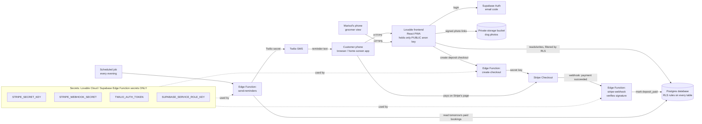

Your spec summary is here and nothing is left blank, so this is the right input for stage 3. Here's the architecture.

---

## First: App Store app, or home-screen web app?

**Lovable only builds web apps.** It makes a website (React code) with a Lovable Cloud / Supabase backend. It can't produce an iPhone or Android app that you upload to the App Store or Google Play. Turning a Lovable site into a store app means "wrapping" it in a native shell. The standard tool for that (Capacitor) needs the terminal, Xcode and Android Studio. Some paid no-code wrapper services will do it for you, but that adds cost, a review process and one more vendor.

Your two options:

| | **A. Home-screen web app (a "PWA", Progressive Web App: a website that can be installed like an app)** | **B. App Store / Google Play app** |
|---|---|---|
| How customers get it | Open a link, then tap "Add to Home Screen" | Search the store, then tap Install |
| What customers give up | They **can't find it by searching the App Store or Google Play**. On iPhone, installing takes extra steps (Safari, then the Share button, then "Add to Home Screen"), and many people won't know how. Push notifications are more limited, and on iPhone they only work after the app has been added to the home screen. | Nothing on their side. The costs land on you. |
| What you give up | Nothing extra | Apple Developer fee (about $99/year) and Google Play fee (about $25 one-time). **Every release goes through store review**, which can take a day or more and can be rejected. You must follow store payment rules. Apple also sometimes rejects apps that are "just a website in a wrapper". You'd need a wrapper service or someone comfortable with a terminal. |

**My recommendation: A, the home-screen web app, for V1.**

Here's why it fits your situation:
- Lovable builds it natively, you need no terminal, and it fits a $50/month budget.
- **Your most important notification is the reminder text, which is an SMS, not an app notification.** SMS reaches every customer's phone whether or not they installed anything, so the web app's weaker notifications don't cost you anything here.
- Customers book a few times a year. Most will tap a link Marisol texts them or puts on the van, business cards or Instagram, and that link gets them booking in seconds with nothing to install.

**How this affects the customers who asked for "a real app in the App Store":** they won't find GroomGo by searching the App Store. What to do about it:
1. Put a QR code on the van, cards and invoices that goes straight to the booking page.
2. Add a one-screen "Add GroomGo to your home screen" guide with pictures for iPhone and Android. After that it gets its own icon and opens full-screen like an app.
3. In practice, "I want an app" usually means "I want booking to be easy and on my phone." A fast link that remembers their dog does that.
4. If demand stays strong once the business proves out, wrapping it for the stores later is a separate project (ADR-10). The backend designed below won't need to change.

Because this is a web-only app, the MOBILE-only notes in sections 1, 4, 5 and 10 are skipped.

---

# ARCHITECTURE.md: GroomGo

## 1. Stack Decision

Lovable already makes several of these choices (frontend framework, backend, hosting). I'm going with those choices, not against them.

| Layer | Choice | Why | Rejected alternative & why |
|---|---|---|---|
| **Frontend** (the screens people tap) | React + Tailwind, as generated by Lovable, set up as an installable PWA (app icon, name, full-screen mode) | **Decided by Lovable.** Runs on any iPhone or Android browser. | Separate native apps (SwiftUI/Kotlin): impossible in Lovable, and it would mean two codebases. |
| **Backend/API** (the code that runs on a server you control) | Lovable Cloud (built on Supabase) **Edge Functions**, which are small pieces of server code that run when called | **Decided by Lovable.** It's where secret keys and payment logic can live safely. | Your own server (Node/Express on a VPS, a rented always-on computer): more to maintain, needs the terminal. |
| **Database** | Lovable Cloud / Supabase **Postgres**, a standard, well-documented database, with **Row Level Security** (RLS: rules inside the database that decide which rows each logged-in person may see or change) | **Decided by Lovable.** RLS is what enforces "customers never see other customers' addresses." | Firebase: a different model, and Lovable doesn't drive it natively. |
| **Auth** (logging in) | Supabase Auth with **email one-time code / magic link** (a login link or code sent by email, so there's no password to forget) | Free and built in. Phone-number login would cost an SMS per login. | Phone/SMS login: every login costs money, and it needs the same texting registration anyway. Social login: more setup than V1 needs. |
| **File storage** (dog photos) | Supabase Storage, **private bucket** (a folder that isn't open to the internet), served through **signed URLs** (links that stop working after a set time) | Built in. Photos stay private. | A public bucket: anyone with or guessing the link could see photos. |
| **Payments** | **Stripe Checkout** (Stripe's hosted payment page) for the $20 deposit, confirmed by a **Stripe webhook** (a message Stripe's server sends your server to say "this payment really succeeded") | You already have Stripe. Card details never touch your app. A deposit for an in-person service is fine to take through Stripe. | Building your own card form: more security burden. PayPal: you're already on Stripe. |
| **AI/LLM** | None | The spec doesn't need it. | n/a |
| **Hosting** | Lovable hosting with a custom domain (for example groomgo.com) | **Decided by Lovable.** One click to publish. | Vercel/Netlify: needless extra account. |
| **Notifications** | **Twilio SMS** for the day-before reminder, sent by a **scheduled job** (a task the server runs automatically on a timer, here every evening). Booking confirmations also go by email through Supabase's built-in email or Resend. | SMS reaches every phone, with no install needed. Twilio is the most-documented option. | Push notifications: limited on iPhone web apps and need the app installed. WhatsApp: extra business approval, and not every customer uses it. |
| **Route view** | Plain **Google Maps / Apple Maps links** (tapping an address opens the maps app). No maps API. | Free, no key, nothing to break. | Google Maps API route optimization: costs money, needs a key, overkill for one van. |

## 2. System Diagram

## 3. Data Model

I added two small tables the spec implies but doesn't name: **slots** (the open times Marisol offers) and **user_roles** (who is the groomer). `profiles` holds the spec's "customers" data.

**profiles** (one per customer, linked to their login)
| Field | Type | Notes |
|---|---|---|
| id | uuid, PK | = the auth user's id |
| full_name | text | |
| phone | text | E.164 format (+15551234567) for SMS |
| address_line, city, postcode | text | home address |
| sms_opt_in | boolean | required consent for texting |
| created_at | timestamptz | |

**user_roles**
| Field | Type | Notes |
|---|---|---|
| user_id | uuid, FK → auth user | |
| role | enum: `customer`, `groomer` | |
| | | Unique (user_id, role) |

**dogs**
| Field | Type | Notes |
|---|---|---|
| id | uuid, PK | |
| owner_id | uuid, FK → profiles.id | index |
| name, breed | text | |
| notes | text | temperament, allergies, etc. |
| photo_path | text | path in the private bucket, **not** a public URL |
| created_at | timestamptz | |

**slots** (created by Marisol)
| Field | Type | Notes |
|---|---|---|
| id | uuid, PK | |
| starts_at, ends_at | timestamptz | index on starts_at |
| is_open | boolean | Marisol can close a slot |

**bookings**
| Field | Type | Notes |
|---|---|---|
| id | uuid, PK | |
| customer_id | uuid, FK → profiles.id | index |
| dog_id | uuid, FK → dogs.id | |
| slot_id | uuid, FK → slots.id | |
| service_address | text | copied from the profile at booking time, so old bookings keep the right address |
| status | enum: `pending_payment`, `confirmed`, `cancelled`, `completed` | |
| deposit_paid | boolean, default false | **set only by the Stripe webhook** |
| stripe_session_id | text | unique |
| hold_expires_at | timestamptz | unpaid holds release after about 30 min |
| reminder_sent_at | timestamptz, nullable | stops double-texting |
| created_at | timestamptz | |

Relationships: a profile has many dogs and many bookings. A booking has one dog and one slot.
Useful indexes: `bookings(slot_id)` **unique where status in ('pending_payment','confirmed')`**, which stops two people booking the same slot. Also `bookings(customer_id)`, `slots(starts_at)`, `dogs(owner_id)`.

**How customers see what's free without seeing other people's bookings:** the calendar reads from a database function `available_slots()` that returns **only slot times** (open slots with no active booking). Customers never query the bookings table for other people's rows, so addresses and phone numbers can't leak through the calendar.

### ACCESS RULES

| Entity | Who can read | Create | Update | Delete |
|---|---|---|---|---|
| **profiles** | Own row; groomer: all | Own row (at signup) | Own row (name, phone, address, opt-in) | Nobody in app (Marisol via admin) |
| **user_roles** | Own row only; groomer: all | **Nobody from the app** (set by Marisol in the dashboard) | **Nobody from the app** | Nobody from the app |
| **dogs** | Own dogs; groomer: all | Customer, for self only | Own dogs | Own dogs |
| **dog photos (storage)** | Owner + groomer, through signed URLs | Owner, into own folder only (`{user_id}/…`) | Owner | Owner |
| **slots** | Everyone logged in (times only) | Groomer | Groomer | Groomer |
| **bookings** | **Own bookings only**; groomer: all | Customer, for self, status `pending_payment`, `deposit_paid=false` forced | Customer: cancel own only. Groomer: status. **`deposit_paid`: server webhook only** | Nobody (cancel instead) |

This matches the spec's rule: **customers can never read another customer's profile (address, phone) or booking.**

## 4. Trust Boundaries

**Untrusted (runs on the customer's phone, and anyone can read or alter it):**
- All screens and the React code
- The **anon key** (a public key meant to be visible, safe *only* because RLS rules guard the data)
- Showing/hiding buttons. That's cosmetic only and never the real permission check.

**Trusted (runs on the server):**
- RLS rules on every table and the storage bucket: the real permission checks
- `create-checkout` Edge Function: looks up the price itself ($20, never taken from the browser), checks the slot is still free, creates the booking hold, and creates the Stripe session
- `stripe-webhook` Edge Function: verifies Stripe's signature, then sets `deposit_paid = true` and `status = confirmed`
- `send-reminders` Edge Function + scheduled job: sends Twilio texts
- All secret keys: Stripe secret, Stripe webhook secret, Twilio token, Supabase service-role key (a master key that bypasses all rules)

**Where Lovable tends to get this wrong. Check each of these:**
1. **Pasting secret keys into frontend code.** If you're ever asked for your Stripe *secret* key (starts `sk_`) or a Twilio token, add it only through Lovable's **Secrets** panel, never in chat as code. Only the Stripe *publishable* key (`pk_`) may appear in the frontend, and Checkout doesn't even need it.
2. **Marking the deposit paid from the browser** ("on the success page, set deposit_paid = true"). Refuse this. Anyone could fake it. Only the webhook sets it.
3. **Tables created without RLS, or with an "allow all" rule.** Ask Lovable to run its security check after every database change.
4. **Putting the role in the profiles table** (where customers can edit their own row), or in browser storage. **Role lives only in `user_roles`**, which customers can't write to. The groomer check uses a server-side function `has_role(auth.uid(), 'groomer')`.
5. **Making the photo bucket public** because it's easier to show images. Keep it private.

**Role storage:** in `user_roles`, set once by Marisol (or you) in the Lovable Cloud dashboard. No app screen can change it.

**Files stored:**
| Where | What | Public? |
|---|---|---|
| Storage bucket `dog-photos` | Dog photos | **Private.** Served through signed URLs that expire (for example after 1 hour). |
| Lovable hosting | App code, logo, icons | Public (no personal data) |

Nothing personal is public.

## 5. External Services

| Service | Purpose | Key | Where key is stored | Free tier / cost | If it's down |
|---|---|---|---|---|---|
| **Lovable Cloud (Supabase)** | Database, login, storage, server functions | anon key (public), service-role key (secret) | Anon: frontend. Service-role: Edge Function secrets only | Free usage allowance, then usage-based. Tiny at your scale. | App is down. Rare. Status page to check. |
| **Stripe** | $20 deposits | Secret key + webhook signing secret | Edge Function secrets | No monthly fee. About 2.9% + 30¢ per card payment in the US (about 88¢ per $20 deposit). Check your country's rate. | Customers can't pay, and the booking hold expires and frees the slot. Marisol can take the deposit in person. |
| **Twilio** | Day-before reminder SMS | Account SID + Auth Token | Edge Function secrets | Pay-as-you-go: roughly 1¢ per US text including carrier fees, about $1–2/month per phone number, plus **A2P 10DLC registration** (US business-texting registration: small one-time fees plus a few dollars/month). Check current prices. | Reminders don't send. `reminder_sent_at` stays empty, so the next run retries, and Marisol's day view shows who wasn't reminded. |
| **Email (Supabase built-in, or Resend)** | Login codes, booking confirmation | Resend API key if used | Edge Function secrets | Supabase's built-in email is rate-limited (fine for testing). Resend has a free tier of about 3,000 emails/month. | Login codes delayed. Use Resend before launch for reliability. |
| **Maps links** | Open addresses in navigation | None | n/a | Free | n/a |

**Payment rules:** since this is web-only, App Store payment rules don't apply. (Even as a store app, a deposit for an in-person physical service like grooming is generally allowed through Stripe rather than Apple/Google in-app purchase. Check current store rules if you ever go that route.)

## 6. Cost at 0 / 100 / 1,000 users

Costs grow with **bookings**, not sign-ups. One van can do maybe 100–200 grooms a month however many customers you have. Approximate figures, so check current pricing.

| Item | 0 users (building) | 100 users (~60 bookings/mo) | 1,000 users (~180 bookings/mo, van near capacity) |
|---|---|---|---|
| Lovable plan | ~$25 | ~$25 | ~$25 |
| Lovable Cloud / Supabase usage | $0 | ~$0–5 | ~$5–10 |
| Twilio number + 10DLC monthly | ~$0 (until registered) | ~$3–5 | ~$3–5 |
| SMS reminders | $0 | ~$1 | ~$2–4 |
| Email (Resend) | $0 | $0 | $0 |
| Domain | ~$1 (≈$12/yr) | ~$1 | ~$1 |
| **Monthly total** | **~$26** | **~$30–37** | **~$36–45** |
| Stripe fees (taken from deposits, not your budget) | $0 | ~$53 | ~$158 |

This stays within $50/month. One-time: Twilio/10DLC registration, roughly $20–50 total.

## 7. Decisions Log

- ADR-1: Ship V1 as an installable web app (PWA), not an app-store app, because Lovable only builds web apps, you don't use the terminal, and SMS reminders don't need an installed app.
- ADR-2: Use Lovable's React frontend and Lovable Cloud (Supabase) backend because Lovable is built around them.
- ADR-3: Use Row Level Security on every table and storage bucket as the real permission check, because the browser can't be trusted.
- ADR-4: Store roles only in a `user_roles` table customers can't write, because a role in an editable profile lets anyone make themselves groomer.
- ADR-5: Show availability through an `available_slots()` function that returns only times, because customers must never see other customers' bookings, addresses or phones.
- ADR-6: Take deposits with Stripe Checkout and mark them paid only from a verified Stripe webhook, because the browser can fake a "success" page.
- ADR-7: Send reminders with Twilio SMS from a nightly scheduled server job, because SMS reaches every phone without an install.
- ADR-8: Use email code/magic-link login because it's free and has no passwords to forget.
- ADR-9: Keep dog photos in a private bucket served by expiring links because they belong to the customer.
- ADR-10: Revisit an App Store / Google Play wrapper only after launch if customer demand persists, because it adds fees, reviews and a new vendor.

## 8. Known Risks

| # | Risk | Mitigation |
|---|---|---|
| 1 | **Customer data leaks** through a missing or too-loose RLS rule (for example the groomer day view query copied into a customer screen). | Build the ACCESS RULES table exactly. Run Lovable's security scan after each change. Test with two customer accounts to confirm neither sees the other's bookings or address. |
| 2 | **Deposit marked paid without payment**, or paid without a booking (webhook missed). | Only the verified webhook sets `deposit_paid`. Store `stripe_session_id`. Check the Stripe dashboard against bookings weekly at first. |
| 3 | **Texting registration delays or rejection** (US carriers require A2P 10DLC, which can take days to weeks), so no reminders at launch. | Start Twilio registration **first**, before building. Collect explicit SMS opt-in at signup. Email reminders as a backup until approved. |
| 4 | **Double booking**: two people pay for the same slot at once. | Unique index on active bookings per slot. Booking hold created *before* sending to Stripe. Unpaid holds expire after 30 min. |
| 5 | **Customers expect an App Store app** and don't install the web app, or miss the link. | QR code on van and cards, an "add to home screen" guide, SMS reminders that link back. Measure it and revisit ADR-10 if it becomes a real problem. |

## 9. In Plain English

- **GroomGo will be a website that behaves like an app.** Customers open a link or scan a QR code and can put an icon on their phone's home screen. It won't be in the App Store for now. That keeps it cheap and buildable in Lovable.
- **Each customer can only ever see their own dogs and bookings.** The database itself enforces this, not just the screens, so even a tech-savvy customer can't peek at other people's addresses.
- **Money is handled by Stripe.** Customers pay on Stripe's own secure page, and a booking only counts as paid when Stripe itself confirms it to your server.
- **Reminder texts go out automatically every evening.** Before you can text customers, the phone carriers make you register your business, so start that paperwork first, because it can take a while.
- **Running costs should be around $25–45 a month**, well within your $50, and they grow with bookings, not with how many people sign up.

## 10. Accounts to Set Up Before Building

- [ ] **Lovable** paid plan: about $25/month. Needed for a custom domain and enough build credits.
- [ ] **Lovable Cloud** (turn on inside your Lovable project): free allowance, then usage-based.
- [ ] **Stripe** (you have it): make sure the account is fully activated (business details, bank account) so live payments work. Verification can take a day or two.
- [ ] **Twilio**: pay-as-you-go. Buy a local number (about $1–2/month) and **complete A2P 10DLC business-texting registration. This can take days to a few weeks, so start it today.** You'll need your business name, address and (if you have one) EIN, plus a description of the reminder messages and how customers opt in. If you're outside the US, rules differ, so check Twilio's guidance for your country.
- [ ] **Resend** (optional but recommended): free tier. Verify your domain so login emails don't land in spam (DNS setup takes minutes to hours).
- [ ] **Domain name** (for example groomgo.com): about $12/year from any registrar, or buy it through Lovable.
- [ ] **Marisol's groomer account**: after launch, sign her up normally, then you set her role to `groomer` in the Lovable Cloud dashboard.

Not needed for V1: Apple Developer Program or Google Play Console (only if you revisit ADR-10).

## Context Carry
Platforms: web app (installable PWA) on iPhone and Android browsers. No app stores in V1.
Stack: Lovable (React) frontend; Lovable Cloud/Supabase (Postgres, Auth with email code, private Storage, Edge Functions, scheduled job); Stripe Checkout + webhook; Twilio SMS; Resend email.
Entities: profiles, user_roles, dogs, slots, bookings.
Trust rules: RLS on every table and bucket. Customers read and write only their own rows. Availability comes via `available_slots()` (times only). Role lives only in `user_roles`, which customers can't write. `deposit_paid` is set only by the verified Stripe webhook. Price is set on the server. All secrets live in Edge Function secrets. Dog photos are private and served by expiring links.
ADRs: 1 PWA not stores; 2 Lovable+Supabase; 3 RLS everywhere; 4 roles table; 5 slots-only availability; 6 Stripe webhook confirms; 7 Twilio nightly reminders; 8 email login; 9 private photos; 10 revisit store wrapper later.
