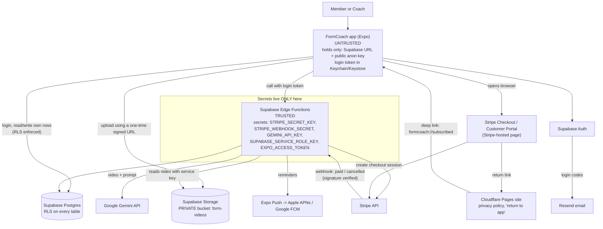

You pasted the SPEC Context Carry, which is the right input for this stage (3, architect), and nothing is left blank. Before the document, three things you need to know. The first one changes one of your plans.

**1. Real app-store app, or a home-screen web app?**
A home-screen web app (a PWA, or "progressive web app": a website people save to their home screen so it looks like an app) could technically work. Browsers can record video and take Stripe payments with no store fees. For FormCoach I still recommend a **real app-store app**, for three reasons:
- Recording, trimming and uploading a 10-second video is noticeably smoother and more reliable in a native app, and that video is your core feature.
- Workout reminders work reliably. On iPhone, web-app notifications only work if the person first "installs" the site, and most people never do.
- People expect a fitness subscription to be something they download from the store.

Your build tool, Expo, makes real iPhone and Android apps from one codebase, so it fits this plan. Expo can also output a web version later from the same code if you ever want one.

**2. Your Stripe plan needs adjusting.** You want to take the $9.99/month through Stripe "inside the app" so Apple and Google get no cut. As written, the stores don't allow that. Both require their own in-app purchase system when an app sells digital features like plans and AI form checks. A Stripe payment form that runs inside the app would get you rejected. What *is* allowed, as far as I know, but **please check the current rules because they are actively changing through court cases**:
- **US App Store:** since a 2025 court ruling in Epic v. Apple, US apps may show a button or link that opens your own website checkout in the browser, and Apple takes no commission on those sales. Apple has been appealing this, so check the current status.
- **US Google Play:** since the Epic v. Google ruling, Google must allow links to outside payment in the US, but Google has said it will charge fees on those link-outs. Check the current fee.
- **Outside the US:** you generally must offer Apple's and Google's in-app purchase. The EU has its own rules, with fees.
- **If you use store billing:** Apple's Small Business Program and Google's subscription rate are both typically **15%** for a business like yours ($1.50 of each $9.99), versus about 6% for Stripe.

**My recommendation:** launch in the **US stores only**. Put a "Subscribe" button in the app that opens a **Stripe Checkout page in the phone's browser** (Stripe Checkout is Stripe's ready-made, Stripe-hosted payment page). Your server decides who has paid, and it's built so you can add store billing (through RevenueCat) later without redoing anything. If Apple or Google push back in review, the fallback is turning on store billing and accepting the 15%.

**3. One question for you (it doesn't block this stage):** can *you*, as coach, see members' form videos and body measurements? The spec only says members can't see each other's. I've designed for **no** (least access). If you want to review videos, tell me and I'll add a coach-read rule. Be aware that as the owner you can always see everything through the Supabase admin dashboard.

---

# ARCHITECTURE.md: FormCoach

## 1. Stack Decision

Terms used below:
- **Frontend:** the app people see and tap.
- **Backend:** code running on a server you control.
- **Database:** where records are stored.
- **Auth:** login.
- **Edge Function:** a small piece of your own server code that Supabase runs for you, so you never manage a server.
- **Row Level Security (RLS):** rules inside the database that decide, per row, who may read or change it. Even a hacked app can't get around them.

| Layer | Choice | Why | Rejected alternative & why |
|---|---|---|---|
| **How the app is built** (MOBILE) | **One codebase for both phones: React Native with Expo** (already decided by your build tool) | One set of code for iPhone and Android. Claude Code writes it well, and Expo handles the hard native parts (camera, secure storage, notifications). | Separate native apps (SwiftUI for iPhone, Kotlin for Android): twice the code and twice the bugs. Flutter: also good, but it fights your chosen tool. |
| **How updates reach users** (MOBILE) | **Expo EAS Update** (over-the-air updates) for small fixes to screens and logic. **App store release** (via EAS Build) for anything that adds native features or permissions. | Over-the-air means a fix reaches phones in minutes, with no store review. | Store releases for every change: a day or more of review each time. |
| Frontend | Expo app (React Native, TypeScript), Expo Router for screens, `expo-camera` to record video | Standard, heavily documented Expo stack | A custom camera library: more native setup than you need |
| Backend / API | **Supabase Edge Functions** for anything secret: Stripe, the AI call, upload permission, subscription checks | You already have Supabase. There's no server to run, and secrets stay off the phone. | Your own Node server on Render or Fly: one more service to run, patch and pay for |
| Database | **Supabase Postgres** with RLS on every table | Managed database, and RLS enforces "members never see other members' data" at the data level | Firebase: the rules language is weaker for relational data like plans, workouts and sets |
| Auth | **Supabase Auth**: email with a 6-digit code or password, plus Sign in with Apple | Built in and free. Apple requires Sign in with Apple if you offer other social logins, so start with email only, or email + Apple. | Clerk or Auth0: another vendor and another bill for no gain |
| File storage | **Supabase Storage, private bucket** `form-videos` | Same permission system as the database. Videos are only served through links that expire. | Public S3/Cloudflare R2 bucket: easy to accidentally make videos public |
| Payments | **Stripe Checkout + Stripe Customer Portal** (Stripe-hosted pages), opened in the browser from the app, US only at launch. A **Stripe webhook** tells your server about payments. (A webhook is Stripe automatically calling your server to say "this person paid" or "this subscription was cancelled.") | Your existing account, about 6% total fees, and Stripe hosts the payment forms so card data never touches your code | A Stripe payment sheet *inside* the app: breaks store rules for digital subscriptions. Store billing only: a 15% cut, but it stays ready as the fallback (via RevenueCat). |
| AI / LLM | **Google Gemini API, a Flash-tier model** (check the current model name), called only from an Edge Function, **paid tier** | It accepts a short video directly, so you don't have to cut videos into still images first. It's cheap per call. The paid tier doesn't use your data to train Google's models. | Claude or OpenAI vision: excellent, but you'd have to split each video into still frames first, which is an extra moving part. Gemini's free tier: may use submitted data for training, which is wrong for body videos. |
| Hosting | App: Apple App Store + Google Play. Backend: Supabase. Small marketing site with privacy policy, terms and a post-checkout "you're subscribed, return to the app" page: **Cloudflare Pages (free)** | The stores require a privacy policy URL, and Stripe needs somewhere to send people after paying | Vercel's free Hobby plan: its terms don't allow commercial use |
| Email / notifications | **Resend** as the email sender for Supabase Auth login codes. **Expo Push Notifications** for workout reminders. | Supabase's built-in email is heavily rate-limited and meant only for testing. Expo Push is free and handles Apple and Google push for you. | SendGrid: fine, but the setup is fussier. Sending push directly through Apple and Google: more setup for the same result. |

## 2. System Diagram

## 3. Data Model

Every table has `id uuid primary key` and `created_at timestamptz` unless noted. "FK" means foreign key, a link to a row in another table.

**profiles** (one per user, linked 1-to-1 to Supabase's login table)
| Field | Type | Notes |
|---|---|---|
| id | uuid, PK, FK → auth.users.id | same id as their login |
| email | text | copied from auth, read-only for the user |
| display_name | text | |
| units | text (`kg`/`lb`) | |
| timezone | text | for reminders |
| expo_push_token | text, nullable | for workout reminders |
| created_at | timestamptz | |

**user_roles** (kept separate so no one can promote themselves)
| Field | Type | Notes |
|---|---|---|
| user_id | uuid, PK, FK → profiles.id | |
| role | text check in (`member`,`coach`) | default `member`. Only you set `coach`, by hand in the Supabase dashboard. |

**body_measurements** (sensitive, in its own table so it can be locked down separately)
| Field | Type | Notes |
|---|---|---|
| member_id | uuid, FK → profiles.id | |
| measured_on | date | |
| weight_kg | numeric | |
| waist_cm, chest_cm, hips_cm, arm_cm, thigh_cm | numeric, nullable | |
Index: `(member_id, measured_on desc)`

**exercises** (a library the coach maintains)
| Field | Type | Notes |
|---|---|---|
| name | text, unique | e.g. "Goblet squat" |
| equipment | text | |
| form_cues | text | fed to the AI as the checklist of what good form looks like |
| video_check_supported | boolean | only some lifts get AI form checks |

**plan_templates** (the coach's weekly plans)
| Field | Type | Notes |
|---|---|---|
| name | text | e.g. "Beginner full body, week 1" |
| level | text | |
| is_published | boolean | members only see published ones |
| created_by | uuid, FK → profiles.id | the coach |
| updated_at | timestamptz | |

**template_items** (what goes in a template)
| Field | Type | Notes |
|---|---|---|
| template_id | uuid, FK → plan_templates.id, cascade delete | |
| day_of_week | smallint 1–7 | |
| exercise_id | uuid, FK → exercises.id | |
| order_index | smallint | |
| target_sets, target_reps | smallint | |
| target_rpe | numeric, nullable | |
Index: `(template_id, day_of_week, order_index)`

**weekly_plans** (a member's copy of a template for a given week)
| Field | Type | Notes |
|---|---|---|
| member_id | uuid, FK → profiles.id | |
| template_id | uuid, FK → plan_templates.id | |
| week_start | date | |
Unique: `(member_id, week_start)`

**workouts** (one day's session)
| Field | Type | Notes |
|---|---|---|
| member_id | uuid, FK → profiles.id | stored directly so the access rules stay simple and fast |
| weekly_plan_id | uuid, FK → weekly_plans.id | |
| scheduled_on | date | |
| status | text (`planned`,`done`,`skipped`) | |
| completed_at | timestamptz, nullable | |
Index: `(member_id, scheduled_on)`

**sets** (logged sets)
| Field | Type | Notes |
|---|---|---|
| workout_id | uuid, FK → workouts.id, cascade delete | |
| member_id | uuid, FK → profiles.id | |
| exercise_id | uuid, FK → exercises.id | |
| set_number | smallint | |
| reps | smallint | |
| weight_kg | numeric | |
| rpe | numeric, nullable | |
Index: `(member_id, exercise_id, created_at)`, which powers the progress chart

**form_videos**
| Field | Type | Notes |
|---|---|---|
| member_id | uuid, FK → profiles.id | |
| workout_id | uuid, FK → workouts.id, nullable | |
| exercise_id | uuid, FK → exercises.id | |
| storage_path | text | always `form-videos/{member_id}/{video_id}.mp4` |
| duration_s | numeric | 10 seconds or less, checked on the server |
| status | text (`uploading`,`uploaded`,`analyzing`,`done`,`failed`) | |
| delete_after | timestamptz | video auto-deleted after 60 days, feedback kept |
Index: `(member_id, created_at desc)`

**form_feedback**
| Field | Type | Notes |
|---|---|---|
| video_id | uuid, FK → form_videos.id, unique | |
| member_id | uuid, FK → profiles.id | |
| score | smallint 1–5 | |
| summary | text | |
| cues | jsonb | list of "fix this" points |
| model | text | which AI model produced it |

**subscriptions** (written only by the server)
| Field | Type | Notes |
|---|---|---|
| member_id | uuid, PK, FK → profiles.id | |
| source | text (`stripe`,`apple`,`google`) | ready for store billing later |
| stripe_customer_id | text, unique, nullable | |
| stripe_subscription_id | text, unique, nullable | |
| status | text (`active`,`trialing`,`past_due`,`canceled`) | |
| current_period_end | timestamptz | |
| updated_at | timestamptz | |

**stripe_events** (so a repeated webhook isn't processed twice)
| Field | Type | Notes |
|---|---|---|
| event_id | text, PK | Stripe's event id |
| processed_at | timestamptz | |

**ai_usage** (caps AI spend)
| Field | Type | Notes |
|---|---|---|
| member_id | uuid | |
| day | date | |
| checks | smallint | |
PK: `(member_id, day)`

Relationships in one line: a profile has one role, one subscription, and many measurements, weekly plans, workouts, sets and videos. A weekly plan comes from a template. A workout has many sets. A video has one feedback.

A helper database function, `is_coach()`, checks `user_roles` for the logged-in user. `has_active_sub()` checks `subscriptions` for `status in ('active','trialing') and current_period_end > now()`.

### ACCESS RULES
"Own" means `member_id = the logged-in user`. "Server" means only Edge Functions using the secret service key; the app can't do it.

| Entity | Who can read | Create | Update | Delete |
|---|---|---|---|---|
| profiles | own; coach reads name/email only (via a limited view) | server (created automatically at sign-up) | own (display_name, units, timezone, push token only) | server (account deletion) |
| user_roles | own row | server | **nobody through the app**; you, via the dashboard | server |
| body_measurements | **own only** (not the coach, not other members) | own | own | own |
| exercises | any logged-in user | coach | coach | coach |
| plan_templates / template_items | members: published only; coach: all | coach | coach | coach |
| weekly_plans | own; coach | server (assigns the week's plan when the subscription is active) | server | server |
| workouts | own | server (created from the weekly plan) | own (status, completed_at) | nobody |
| sets | own | own, **only if has_active_sub()** | own | own |
| form_videos (rows) | **own only** | server (after checking subscription + daily cap) | server | own (deletes the file too) |
| Storage `form-videos/{member_id}/…` | **own folder only**, via signed links that expire in 1 hour | upload only through a one-time signed upload URL from the server | nobody | own; server auto-deletes after 60 days |
| form_feedback | own only | server | nobody | cascades with the video |
| subscriptions | own row | server (Stripe webhook) | server | server |
| stripe_events, ai_usage | nobody | server | server | server |

This matches the spec's rule: members can **never** see another member's videos or body measurements, because every read of those tables and folders is limited to the owner. There is no "all members" read path at all.

## 4. Trust Boundaries

**Untrusted (the phone app).** Treat the installed app exactly like a web page anyone can pick apart. Anyone can unpack an app and read every key and line of code inside it. The app contains only:
- The Supabase project URL and **anon key**. This is a public key, *designed* to be visible. On its own it can do only what RLS allows.
- Screens, form layouts, and calls to your Edge Functions.
- Hiding a button in the app is **not** security. The server check is what counts.

**Trusted (Supabase Edge Functions + database rules):**
- All secret keys: Stripe secret key, Stripe webhook secret, Gemini API key, Supabase **service_role** key (the master key that bypasses all rules), and the Expo push access token. They're stored as Supabase Edge Function secrets, never in the app code, never in `.env` files that get bundled into the app, and never in git.
- **Payment actions:** creating a Checkout session, and marking a subscription active or cancelled (only from a Stripe webhook whose signature is verified).
- **Permission checks:** RLS on every table, plus explicit checks inside each Edge Function ("is this user logged in, is their subscription active, have they hit today's cap?").
- **AI calls:** only the `analyze-form` Edge Function talks to Gemini.

**Places your build tool (Claude Code + Expo) tends to put things on the wrong side. Watch for these:**
1. **`EXPO_PUBLIC_` variables.** Anything named `EXPO_PUBLIC_…` is baked into the app for anyone to read. Only the Supabase URL and anon key may use that prefix. If you ever see `EXPO_PUBLIC_STRIPE_SECRET`, `EXPO_PUBLIC_GEMINI_KEY` or a service_role key, that's a leak.
2. **Calling Gemini or Stripe straight from the app** "to keep it simple." That is never OK.
3. **Unlocking features in the app after returning from checkout** ("payment succeeded, set isPro = true"). The app must ask the server instead.
4. **Supabase's default Expo setup keeps the login session in AsyncStorage** (plain, unencrypted app storage). Replace that with `expo-secure-store`. SecureStore has a small size limit, so use Supabase's documented "encrypted session" pattern: the encryption key lives in SecureStore, and only encrypted data goes in regular storage.
5. **Tables created without RLS turned on.** Every new table must have RLS enabled plus policies, or the anon key can read the whole thing.

**Where roles are stored:** in the `user_roles` table. RLS means members can read their own row and no one can write to it from the app. You set `coach` by hand in the dashboard. Roles are **not** stored in Supabase's `user_metadata` (users can edit that themselves), in the profile, or on the phone.

**Where files are stored:**
| Location | Public? | Contents |
|---|---|---|
| Supabase Storage bucket `form-videos` | **Private** | Member form videos. Viewed only via signed URLs that expire in 1 hour, created for the owner. Auto-deleted after 60 days. |
| Gemini API | Not public | The video is sent for analysis on the paid tier (not used for training). Don't use Gemini's Files API storage; send the video directly with the request. |
| The phone's temporary folder | Local only | The recorded video before upload. Deleted after a successful upload. |
| Cloudflare Pages | **Public** | Only the marketing page, privacy policy, terms, and "return to app" page. No personal data. |
| Supabase `exercise-media` bucket (optional) | Public | Demo images and videos *you* make of each exercise. Never member content. |

**MOBILE: login tokens** are kept in Keychain (iPhone) and Keystore (Android) via `expo-secure-store` as described above. They never go in AsyncStorage, UserDefaults or SharedPreferences as plain text.

**MOBILE: purchases.** With Stripe, "paid" is decided only when your server receives a signed Stripe webhook. If you add Apple/Google billing later, use RevenueCat, which checks every purchase with Apple or Google on the server and notifies your server through its own webhook. Either way, nothing unlocks based on what the app says.

**MOBILE: deep links** (links that open the app directly on a specific screen). Your app scheme is `formcoach://`, plus "universal links" (normal web links that open the app if it's installed) on your domain.
| Link | What it does | Protection |
|---|---|---|
| `formcoach://auth/callback?code=…` | Finishes email login | The one-time code is exchanged with Supabase (PKCE, a method that makes a stolen link useless on another phone). By itself it grants nothing. |
| `formcoach://subscribed` | Return after Stripe checkout | Only shows a "checking your subscription…" screen that asks the server. It **never** unlocks anything itself. |
| `formcoach://workout/{id}` | Opens a workout from a reminder | Requires login. RLS returns nothing if the workout isn't yours. |
| `formcoach://video/{id}` | Opens feedback from a notification | Requires login. RLS plus owner-only signed URLs. |
None of these links skip login or permission checks.

## 5. External Services

| Service | Purpose | Key(s) | Where the key lives | Free tier / limits | If it's down |
|---|---|---|---|---|---|
| Supabase | Database, login, file storage, Edge Functions | anon key (public), service_role key (secret) | anon: in the app. service_role: Edge Function secrets only. | Free: 500 MB database, 1 GB storage, 2 projects, **pauses after 1 week of no activity**. Pro $25/mo: 8 GB database, 100 GB storage, 250 GB egress (data sent out), no pausing. | The whole app is down. Show a friendly "can't connect" screen. Supabase has a status page. |
| Stripe | $9.99/mo subscription, hosted checkout, customer portal | secret key, webhook signing secret (the app gets none) | Edge Function secrets | No monthly fee. About 2.9% + 30¢ per US card charge, plus Stripe Billing about 0.7% (check current). | New sign-ups fail. Existing members keep access because your database stores `current_period_end`. Stripe re-sends missed webhooks for up to 3 days. |
| Google Gemini API | Form feedback from the video | GEMINI_API_KEY | Edge Function secrets | Use the **paid tier** (the free tier may use data for training). Roughly $0.002–$0.005 per 10-second check. Check current pricing. | Video saves as "analysis pending", the server retries later, and the member sees "feedback coming soon." |
| Resend | Sends login-code emails for Supabase Auth | SMTP password | Supabase Auth settings (server side) | Free: 3,000 emails/mo, 100/day. $20/mo for 50,000. | People can't log in on a new phone. Existing sessions keep working. |
| Expo EAS (Build, Update, Submit) | Builds the app in the cloud, pushes over-the-air updates, uploads to the stores | Expo account token (on your computer or in CI only) | Your machine | Free plan: a limited number of cloud builds per month, and updates for up to about 1,000 monthly active users. Check current limits. | You can't ship a new version until it's back. The live app is unaffected. |
| Expo Push → Apple APNs / Google FCM (MOBILE) | Workout reminders, "your feedback is ready" | Expo access token. Apple push key and Firebase project are set up through EAS credentials. | Edge Function secrets / EAS | Free | Reminders don't arrive. Nothing else breaks. |
| Cloudflare Pages | Privacy policy, terms, return page | none | n/a | Free | Only the "return to app" page breaks. The app still checks subscription status on its own. |
| RevenueCat (later, only if needed) | Apple/Google in-app purchase checking | secret API key | Edge Function secrets | Free until $2.5k/month of tracked revenue, then 1% (check current) | New store purchases can't be confirmed |

**MOBILE: do Apple and Google require their in-app purchase for what you sell?** Probably yes. Workout plans and AI form checks are digital features used inside the app, which is exactly what both stores' rules cover. (Physical goods or in-person coaching would be exempt, but that isn't what you're selling.) Their cut on subscriptions is typically 15% for small businesses (Apple's Small Business Program, under $1M/year; Google subscriptions) and up to 30% otherwise. In the **US only**, recent court rulings let apps link out to their own web checkout. Apple currently takes no cut on those purchases (under appeal), and Google has announced fees for link-outs. **Check both stores' current rules before you submit.** They have changed several times since 2024 and may change again.

## 6. Cost at 0 / 100 / 1,000 users (rough, monthly)

Assumptions: each member does about 15 form checks a month, capped at 2 per day. Videos are recorded at 720p (about 5 MB each) and deleted after 60 days.

| Item | 0 users (building) | 100 users | 1,000 users |
|---|---|---|---|
| Supabase | $0 (free while building) → $25 at launch | $25 | $25–40 (more storage/compute) |
| Gemini AI | ~$0 | ~$5 | ~$40–75 |
| Resend | $0 | $0 | $0–20 |
| Expo EAS | $0 | $0 | $0–19 (if you go over the free update limits) |
| Cloudflare Pages | $0 | $0 | $0 |
| Domain | ~$1 | ~$1 | ~$1 |
| Apple Developer ($99/yr) | ~$8 | ~$8 | ~$8 |
| **Fixed costs total** | **~$10 building, ~$35 at launch** | **~$40** | **~$75–165** |
| Stripe fees (taken from revenue) | $0 | ~$60 of $999 revenue | ~$600 of $9,990 revenue |

You're comfortably within $75 through a few hundred members. At 1,000 members you'll pass $75 in fixed costs, but revenue is about $10k/month by then. The AI line is the one to watch, which is why there's a daily cap.

## 7. Decisions Log

- ADR-1: Build one Expo (React Native) app for iPhone and Android because it's your chosen tool and one codebase halves the work.
- ADR-2: Ship as a real app-store app, not a home-screen web app, because smooth video recording and reliable reminders are core.
- ADR-3: Use Supabase (Postgres, Auth, Storage, Edge Functions) as the whole backend because you already have it and it removes the need to run a server.
- ADR-4: Enforce all access with Row Level Security on every table and storage folder because it holds even if the app is tampered with.
- ADR-5: Store roles in a server-only `user_roles` table because users can edit their own metadata.
- ADR-6: Keep all secret keys only in Edge Function secrets because anything in the app can be extracted.
- ADR-7: Store login sessions encrypted, with the key in Keychain/Keystore via expo-secure-store, because AsyncStorage is plain text.
- ADR-8: Sell the subscription through Stripe Checkout opened in the browser, US storefronts only at launch, because a Stripe payment form inside the app breaks store rules.
- ADR-9: Mark subscriptions active only from signed Stripe webhooks, never from the app, because the app can lie.
- ADR-10: Keep a `source` field on subscriptions so Apple/Google billing (via RevenueCat) can be added later without a redesign.
- ADR-11: Use Gemini (paid tier), called only from an Edge Function, for form feedback because it reads video directly and doesn't train on paid-tier data.
- ADR-12: Store form videos in a private bucket, serve them via 1-hour signed links, and delete them after 60 days, because they're personal and storage grows fast.
- ADR-13: Cap AI checks at 2 per member per day because AI is the cost that grows with usage.
- ADR-14: Use Resend for login emails because Supabase's built-in sender is only for testing.
- ADR-15: Use EAS Update for small fixes and store releases for native changes because it avoids review delays.

## 8. Known Risks

| # | Risk | Mitigation |
|---|---|---|
| 1 | **App store rejection over payments**: the Stripe link-out rules change, or the reviewer disagrees | Launch US-only. Check the current rules right before submitting. Keep ADR-10 ready so you can switch on store billing via RevenueCat within about a day of work. |
| 2 | **A private video or measurement leaks**: RLS missing on a table, a public bucket, a key in `EXPO_PUBLIC_` | Enable RLS on every table from day one. Keep the bucket private. Before launch, test by logging in as member B and trying to fetch member A's video and measurements (it must fail). Stage 6 (the security gate) checks this. |
| 3 | **Bad or unsafe AI form feedback**: the AI misreads the video and gives advice that could lead to injury | Only allow checks on lifts you've marked `video_check_supported`. Give the AI your coaching cues as the checklist. Show a clear "AI feedback, not medical advice; stop if you feel pain" note. Let members flag bad feedback to you. |
| 4 | **Runaway AI or storage costs** | Daily cap per member, 10-second limit checked on the server, 720p recording, 60-day auto-delete, and a monthly spending alert in your Google Cloud billing. |
| 5 | **Subscription state gets out of sync** (a webhook is missed, someone cancels, a card fails) | Record every Stripe event id to avoid double-processing. Rely on `current_period_end`. Run a nightly Edge Function that re-checks subscriptions with Stripe. Handle `past_due` with a grace period of a few days. |

## 9. In Plain English

- **The app on people's phones is just a display.** Anything important (who has paid, who can see which videos, talking to the AI) happens on a server you rent from Supabase, which people can't tamper with.
- **Each member's videos and body measurements are locked to that member.** The database itself refuses to hand them to anyone else, even if someone hacks the app.
- **People pay you on a Stripe web page, not inside the app.** That's how you avoid Apple's and Google's cut legally, and for now that works in the US only. If the stores push back, there's a ready plan B that costs you 15%.
- **Stripe tells your server directly when someone pays or cancels**, a bit like a bank texting you, so no one can fake being a subscriber.
- **Running costs start around $35/month** and stay under your $75 budget until you have a few hundred paying members. By then subscriptions easily cover the bills.

## 10. Accounts to Set Up Before Building

- [ ] **Supabase**: you have it. Create a new project for FormCoach. Free while building; plan to upgrade to Pro ($25/mo) before launch so it doesn't pause.
- [ ] **Stripe**: you have it. Create the "FormCoach Monthly" $9.99 product, turn on the Customer Portal, and complete business verification if it isn't already done.
- [ ] **Apple Developer Program**: $99/year (check the current fee). Enrolling as an individual is usually quick. Enrolling as a company needs a D-U-N-S number (a free business ID), and **that can take several days to weeks**. Then apply to the **Small Business Program** so any future Apple cut is 15%.
- [ ] **Google Play Console**: $25 one-time (check the current fee). **Identity verification can take days.** New personal developer accounts must also run a **closed test with at least 12 testers for 14 days** before they can publish publicly (check the current requirement). Recruit testers early.
- [ ] **Expo account**: free. Log in to EAS from your terminal.
- [ ] **Google Cloud / AI Studio for Gemini**: free to create. Add billing so you're on the paid tier, and **set a budget alert** (e.g. $30).
- [ ] **Resend**: free. You'll need to add DNS records to your domain (usually live within hours).
- [ ] **A domain name**: about $10–15/year, for the privacy policy, return page, email sender, and universal links. You can register it through Cloudflare.
- [ ] **Cloudflare**: free, for Pages hosting.
- [ ] **A privacy policy and terms page**: both stores require them. They need to mention video, body measurements, AI processing by Google, and Stripe.
- [ ] **Plan for review delays:** every app store release goes through review. Expect about 1 day for Apple (sometimes more) and anywhere from hours to several days for Google, especially the first time. Plan your first submission at least 1–2 weeks before any launch date you promise anyone.

---

## Context Carry
Platforms: iPhone + Android (real app-store apps), one Expo/React Native codebase; small public web page for policy/checkout return.
Stack: Expo + EAS Build/Update; Supabase Postgres/Auth/Storage/Edge Functions; Stripe Checkout (browser, US-only launch) + webhooks; Gemini Flash paid tier; Resend; Expo Push; Cloudflare Pages.
Entities: profiles, user_roles, body_measurements, exercises, plan_templates, template_items, weekly_plans, workouts, sets, form_videos, form_feedback, subscriptions, stripe_events, ai_usage.
Trust rules: app is untrusted and holds only the Supabase URL and anon key. All secrets, payments, AI calls and subscription checks live in Edge Functions. RLS on every table. Videos and measurements are owner-only; the coach can't see them. Role lives in server-only user_roles. Private video bucket with 1-hour signed URLs and 60-day deletion. Sessions stored in SecureStore. Unlock only after a verified webhook. Deep links never grant access.
ADRs: 1–15 as listed.
Open question: coach access to videos (currently no).
